# Smart Kos — Entity Relationship Diagram

## 1. Purpose

This document defines the database structure for Smart Kos.

Smart Kos is a private/internal web application for one kos owner who manages multiple kos locations, rooms, tenants, staff, payments, complaints, and financial records.

The database design follows the project rules defined in `AGENTS.md`:

* One central `users` table is used for all authenticated accounts.
* Roles are hardcoded in application logic.
* Guest users do not require database accounts.
* TailAdmin structure is unrelated to the database design and must not be reorganized to fit the ERD.
* Financial history must be preserved even when an account is deactivated or removed.
* Midtrans Virtual Account and Manual Transfer are separate payment mechanisms.
* Authorization is handled by Laravel middleware/policies, not by dynamically generated menu records.

---

# 2. Main Database Domains

```text
Users & Accounts
        │
        ├── Admin
        ├── Staff
        └── Tenant
                │
                ▼
        Room Assignment
                │
                ▼
        Room ← Location
                │
        ┌───────┼───────────────┐
        │       │               │
        ▼       ▼               ▼
   VA Account  Payments     Complaints
        │       │               ▼
        │       │         Complaint Actions
        │       │
        │       ├── Manual Payment
        │       └── VA Payment
        │
        ▼
   Payment History
        │
        ▼
   Financial Records
        │
        ├── Operating Expenses
        ├── Maintenance Expenses
        ├── Payroll
        ├── Cash Advances
        └── Other Income/Expense
```

---

        # 6.1 `location_photos`

        Stores additional photos for a location. The legacy `locations.photo_path`
        field remains readable for existing records, while new uploads are stored here.

        ```text
        location_photos
        ------------------------------------------------
        id
        location_id
        path
        created_at
        updated_at
        ```

        A location can have multiple photos.

# 3. High-Level ERD

```mermaid
erDiagram

    USERS {
        bigint id PK
        varchar name
        varchar username UK
        varchar email UK
        varchar password
        enum role
        enum status
        timestamp last_login_at
        timestamp inactive_at
        timestamp created_at
        timestamp updated_at
    }

    ADMIN_GOOGLE_ACCOUNTS {
        bigint id PK
        bigint user_id FK
        varchar google_id UK
        varchar google_email
        timestamp verified_at
        timestamp created_at
        timestamp updated_at
    }

    LOCATIONS {
        bigint id PK
        varchar name
        text address
        varchar google_maps_url
        text description
        varchar photo_path
        int floor_count
        enum status
        timestamp created_at
        timestamp updated_at
    }

      LOCATION_PHOTOS {
        bigint id PK
        bigint location_id FK
        varchar path
        timestamp created_at
        timestamp updated_at
      }

    ROOMS {
        bigint id PK
        bigint location_id FK
        int floor_name
        int room_number
        decimal rent_amount
        enum status
        timestamp created_at
        timestamp updated_at
    }

    TENANT_PROFILES {
        bigint id PK
        bigint user_id FK
        varchar phone
        text address
        date registered_at
        timestamp created_at
        timestamp updated_at
    }

    ROOM_ASSIGNMENTS {
        bigint id PK
        bigint room_id FK
        bigint tenant_id FK
        date start_date
        date end_date
        enum status
        decimal rent_amount_snapshot
        timestamp deactivated_at
        timestamp created_at
        timestamp updated_at
    }

    MIDTRANS_VA_ACCOUNTS {
        bigint id PK
        bigint room_id FK
        varchar bank_code
        varchar va_number
        varchar external_id UK
        decimal amount
        enum status
        timestamp expires_at
        timestamp created_at
        timestamp updated_at
    }

    VA_PAYMENTS {
        bigint id PK
        bigint va_account_id FK
        bigint room_assignment_id FK
        varchar order_id UK
        varchar transaction_id
        decimal amount
        enum transaction_status
        timestamp transaction_time
        timestamp paid_at
        timestamp created_at
        timestamp updated_at
    }

    MANUAL_PAYMENTS {
        bigint id PK
        bigint room_assignment_id FK
        bigint submitted_by FK
        decimal amount
        varchar bank_name
        varchar bank_account_number
        varchar proof_path
        enum status
        bigint verified_by FK
        timestamp submitted_at
        timestamp verified_at
        text rejection_reason
        timestamp created_at
        timestamp updated_at
    }

    PAYMENT_REMAINDERS {
        bigint id PK
        bigint room_assignment_id FK
        enum channel
        enum reminder_type
        date scheduled_for
        timestamp sent_at
        enum status
        text error_message
        timestamp created_at
        timestamp updated_at
    }

    POSTS {
        bigint id PK
        bigint author_id FK
        varchar title
        text content
        varchar image_path
        enum status
        timestamp published_at
        timestamp created_at
        timestamp updated_at
    }

    POST_TARGETS {
        bigint id PK
        bigint post_id FK
        enum target_type
        bigint location_id FK
        bigint room_id FK
        timestamp created_at
    }

    COMPLAINTS {
        bigint id PK
        bigint tenant_id FK
        varchar title
        text description
        varchar image_path
        enum status
        boolean highlighted
        timestamp submitted_at
        timestamp created_at
        timestamp updated_at
    }

    COMPLAINT_ACTIONS {
        bigint id PK
        bigint complaint_id FK
        bigint staff_id FK
        text action_description
        varchar image_path
        enum status
        timestamp completed_at
        timestamp created_at
        timestamp updated_at
    }

    EXPENSE_CATEGORIES {
        bigint id PK
        varchar name
        enum type
        timestamp created_at
        timestamp updated_at
    }

    EXPENSES {
        bigint id PK
        bigint location_id FK
        bigint category_id FK
        bigint recorded_by FK
        varchar title
        text description
        decimal amount
        date expense_date
        varchar receipt_path
        timestamp created_at
        timestamp updated_at
    }

    PAYROLL_RECORDS {
        bigint id PK
        bigint staff_id FK
        bigint recorded_by FK
        decimal gross_amount
        decimal cash_advance_deduction
        decimal net_amount
        date payment_date
        text notes
        timestamp created_at
        timestamp updated_at
    }

    CASH_ADVANCES {
        bigint id PK
        bigint staff_id FK
        bigint recorded_by FK
        decimal amount
        date advance_date
        enum status
        text notes
        timestamp created_at
        timestamp updated_at
    }

    FINANCIAL_RECORDS {
        bigint id PK
        bigint location_id FK
        bigint recorded_by FK
        enum type
        varchar reference_type
        bigint reference_id
        varchar description
        decimal amount
        date transaction_date
        timestamp created_at
        timestamp updated_at
    }

    USERS ||--o| TENANT_PROFILES : has
    USERS ||--o{ ADMIN_GOOGLE_ACCOUNTS : owns

    LOCATIONS ||--o{ ROOMS : contains
    LOCATIONS ||--o{ LOCATION_PHOTOS : has
    TENANT_PROFILES ||--o{ ROOM_ASSIGNMENTS : receives
    ROOMS ||--o{ ROOM_ASSIGNMENTS : has

    ROOMS ||--o| MIDTRANS_VA_ACCOUNTS : has

    MIDTRANS_VA_ACCOUNTS ||--o{ VA_PAYMENTS : receives
    ROOM_ASSIGNMENTS ||--o{ VA_PAYMENTS : generates

    ROOM_ASSIGNMENTS ||--o{ MANUAL_PAYMENTS : has
    USERS ||--o{ MANUAL_PAYMENTS : submits
    USERS ||--o{ MANUAL_PAYMENTS : verifies

    ROOM_ASSIGNMENTS ||--o{ PAYMENT_REMAINDERS : receives

    USERS ||--o{ POSTS : creates
    POSTS ||--o{ POST_TARGETS : targets
    LOCATIONS ||--o{ POST_TARGETS : receives
    ROOMS ||--o{ POST_TARGETS : receives

    TENANT_PROFILES ||--o{ COMPLAINTS : creates
    COMPLAINTS ||--o{ COMPLAINT_ACTIONS : has
    USERS ||--o{ COMPLAINT_ACTIONS : handles

    EXPENSE_CATEGORIES ||--o{ EXPENSES : categorizes
    LOCATIONS ||--o{ EXPENSES : incurs
    USERS ||--o{ EXPENSES : records

    USERS ||--o{ PAYROLL_RECORDS : receives
    USERS ||--o{ PAYROLL_RECORDS : records

    USERS ||--o{ CASH_ADVANCES : receives
    USERS ||--o{ CASH_ADVANCES : records

    LOCATIONS ||--o{ FINANCIAL_RECORDS : belongs_to
    USERS ||--o{ FINANCIAL_RECORDS : records
```



---

# 4. Entity Definitions

## 4.1 `users`

Central authentication table.

All authenticated accounts are stored here.

```text
users
------------------------------------------------
id
name
username
email
password
role
status
last_login_at
inactive_at
created_at
updated_at
```

### Role

```text
admin
staff
penyewa
```

Guest is not stored as a user.

### Status

```text
active
inactive
```

Do not create separate authentication tables such as:

```text
admin_users
staff_users
tenant_users
```

---

# 5. `admin_google_accounts`

Stores the Google identity used specifically for Admin Recovery.

This is intentionally separate from normal login.

```text
admin_google_accounts
------------------------------------------------
id
user_id
google_id
google_email
verified_at
created_at
updated_at
```

Relationship:

```text
users (admin)
        │
        └── admin_google_accounts
```

Only users with:

```text
role = admin
```

may be related to this table.

Google OAuth is not the normal Smart Kos login method.

Normal login remains:

```text
username + password
```

Admin recovery uses:

```text
/admin-recovery
        ↓
Google OAuth
        ↓
verify Google identity
        ↓
match registered admin
        ↓
allow recovery
```

---

# 6. `locations`

Represents a physical kos location.

```text
locations
------------------------------------------------
id
name
address
google_maps_url
description
photo_path
floor_count
status
created_at
updated_at
```

Information includes:

* location name;
* address;
* Google Maps point/link;
* facility description;
* location photo;
* number of floors.

Deleting a location must be treated as a sensitive admin action.

---

# 7. `rooms`

Represents an individual room inside a location.

```text
rooms
------------------------------------------------
id
location_id
floor_name
room_number
rent_amount
status
created_at
updated_at
```

Example:

```text
Location: Kos A

Floor 1
Room 101
Room 102
Room 103

Floor 2
Room 201
Room 202
Room 203
```

### Room status

```text
empty
occupied
inactive
```

The room's occupancy should be determined from active room assignment data.

---

# 8. `tenant_profiles`

Stores tenant-specific information separately from authentication credentials.

```text
tenant_profiles
------------------------------------------------
id
user_id
phone
address
registered_at
created_at
updated_at
```

Relationship:

```text
users
  │
  └── tenant_profiles
```

The `user_id` should point to a user whose role is:

```text
penyewa
```

---

# 9. `room_assignments`

Represents the relationship between a tenant and a room.

This is separated from `rooms` because room occupancy is historical.

```text
room_assignments
------------------------------------------------
id
room_id
tenant_id
start_date
end_date
status
rent_amount_snapshot
deactivated_at
created_at
updated_at
```

### Important design

`tenant_id` references:

```text
tenant_profiles.id
```

not directly `users.id`.

### Status

```text
active
inactive
completed
```

Example:

```text
Tenant A
    ↓
Room 101
    ↓
01 January 2026
    ↓
active
```

When the tenant leaves:

```text
active
   ↓
completed
```

Historical assignment remains in the database.

---

# 10. Seven-Day Tenant Deactivation Rule

The application requirement states that a tenant account can become inactive after more than 7 days according to the account lifecycle policy.

This should not be implemented by deleting the assignment or financial history.

Recommended lifecycle:

```text
Tenant Account
     │
     ▼
active
     │
     ▼
inactive
     │
     ├── admin can reactivate
     │
     └── after allowed period
             ↓
       eligible for deletion
```

Financial history must remain preserved.

---

# 11. `midtrans_va_accounts`

This table is dedicated to Midtrans Virtual Account configuration.

It is intentionally **separate from payment transactions** and completely separate from manual transfer records.

```text
midtrans_va_accounts
------------------------------------------------
id
room_id
bank_code
va_number
external_id
amount
status
expires_at
created_at
updated_at
```

Example:

```text
Room 101
   │
   └── Midtrans VA
          │
          ├── BNI
          ├── VA Number
          └── Amount
```

The VA belongs to a room rather than directly to a tenant because the rent configuration is a property of the assigned room.

When a tenant changes, the active room VA can continue to represent that room's configured payment channel.

---

# 12. `va_payments`

Contains actual Midtrans Virtual Account transactions.

This is intentionally separate from `manual_payments`.

```text
va_payments
------------------------------------------------
id
va_account_id
room_assignment_id
order_id
transaction_id
amount
transaction_status
transaction_time
paid_at
created_at
updated_at
```

Possible transaction status:

```text
pending
settlement
paid
expire
cancel
deny
refund
```

The exact provider status mapping should be normalized by the application.

### Relationship

```text
midtrans_va_accounts
        │
        └── va_payments
```

and:

```text
room_assignments
        │
        └── va_payments
```

This allows the system to know:

* which VA received the payment;
* which room the payment belongs to;
* which tenant assignment was active at the time;
* how much was paid;
* when the transaction was completed.

---

# 13. `manual_payments`

Contains manual bank transfer submissions.

This is completely separate from `va_payments`.

```text
manual_payments
------------------------------------------------
id
room_assignment_id
submitted_by
amount
bank_name
bank_account_number
proof_path
status
verified_by
submitted_at
verified_at
rejection_reason
created_at
updated_at
```

### Status

```text
pending
approved
rejected
```

Flow:

```text
Tenant
  ↓
Manual Transfer
  ↓
Upload Proof
  ↓
Submit
  ↓
pending
  ↓
Admin
  ├── Approve
  └── Reject
```

The uploaded proof must be stored using Laravel Filesystem according to `AGENTS.md`.

---

# 14. Why VA and Manual Payments Are Separate

Do not combine:

```text
VA payment
Manual payment
```

into one transaction table.

Reason:

```text
Midtrans VA
    ├── provider transaction ID
    ├── VA number
    ├── order ID
    ├── automated transaction status
    └── provider callback/webhook

Manual Transfer
    ├── bank information
    ├── proof image
    ├── admin verification
    ├── rejection reason
    └── manual approval
```

They have fundamentally different workflows.

The two mechanisms can later contribute to the same financial reporting layer without sharing the same operational table.

---

# 15. `payment_reminders`

Tracks automated payment reminders.

```text
payment_reminders
------------------------------------------------
id
room_assignment_id
channel
reminder_type
scheduled_for
sent_at
status
error_message
created_at
updated_at
```

### Channel

```text
email
whatsapp
```

### Reminder type

```text
H-3
H
```

### Status

```text
pending
sent
failed
```

This entity supports Laravel Scheduler + Queue.

---

# 16. `posts`

Stores announcements from admin or staff.

```text
posts
------------------------------------------------
id
author_id
title
content
image_path
status
published_at
created_at
updated_at
```

Author can be:

```text
admin
staff
```

---

# 17. `post_targets`

Defines where a post is displayed.

A post can target:

```text
all_locations
specific_location
specific_room
```

```text
post_targets
------------------------------------------------
id
post_id
target_type
location_id
room_id
created_at
```

### Target type

```text
all
location
room
```

Examples:

```text
Post A
→ all locations

Post B
→ Location A

Post C
→ Room 203 at Location B
```

For `all`, `location_id` and `room_id` are null.

For `location`, `location_id` is required.

For `room`, `room_id` is required.

The application must validate these combinations.

---

# 18. `complaints`

Stores complaints submitted by tenants.

```text
complaints
------------------------------------------------
id
tenant_id
title
description
image_path
status
highlighted
submitted_at
created_at
updated_at
```

### Status

```text
belum
dalam_perbaikan
selesai
```

A complaint may optionally contain an image.

---

# 19. `complaint_actions`

Stores staff/admin responses and maintenance actions.

```text
complaint_actions
------------------------------------------------
id
complaint_id
staff_id
action_description
image_path
status
completed_at
created_at
updated_at
```

Although the field is named `staff_id`, it may reference an authenticated user whose role is:

```text
admin
staff
```

A future implementation may rename this to `handled_by` if that better represents both roles.

### Status

```text
belum
dalam_perbaikan
selesai
```

Changing the status to:

```text
selesai
```

requires confirmation at the application level.

---

# 20. Complaint Highlight

Admin can highlight complaints that need staff attention.

This is represented by:

```text
complaints.highlighted
```

Example:

```text
highlighted = true
```

The UI can display a visual highlight without introducing another database table.

---

# 21. `expense_categories`

Defines financial expense categories.

```text
expense_categories
------------------------------------------------
id
name
type
created_at
updated_at
```

Examples:

```text
Electricity
Water
Internet
Security Fee
AC Service
Lamp Replacement
Water Pump Repair
Other Maintenance
```

### Type

```text
operational
maintenance
other
```

---

# 22. `expenses`

Stores operational and incidental expenses.

```text
expenses
------------------------------------------------
id
location_id
category_id
recorded_by
title
description
amount
expense_date
receipt_path
created_at
updated_at
```

Examples:

```text
Monthly electricity
Monthly water
ISP
Security fee
AC repair
Pump repair
Lamp replacement
```

`location_id` may be nullable for owner-level expenses that are not tied to one location.

---

# 23. `payroll_records`

Stores staff salary payments.

```text
payroll_records
------------------------------------------------
id
staff_id
recorded_by
gross_amount
cash_advance_deduction
net_amount
payment_date
notes
created_at
updated_at
```

Calculation:

```text
net_amount =
gross_amount - cash_advance_deduction
```

The actual amount should be stored rather than recalculated from mutable records when historical reporting is required.

---

# 24. `cash_advances`

Stores staff cash advances.

```text
cash_advances
------------------------------------------------
id
staff_id
recorded_by
amount
advance_date
status
notes
created_at
updated_at
```

### Status

```text
outstanding
partially_repaid
repaid
cancelled
```

These records remain historical even when the staff account becomes inactive.

---

# 25. `financial_records`

This is the normalized financial reporting layer.

It allows the application to build:

```text
cash flow
income
expense
profit/loss
monthly summaries
location summaries
```

```text
financial_records
------------------------------------------------
id
location_id
recorded_by
type
reference_type
reference_id
description
amount
transaction_date
created_at
updated_at
```

### Type

```text
income
expense
```

### Example references

```text
VA Payment
Manual Payment
Operational Expense
Maintenance Expense
Payroll
Other Income
Other Expense
```

`reference_type` + `reference_id` allows a financial record to point back to its source record.

Example:

```text
financial_records
    type = income
    reference_type = va_payment
    reference_id = 35
```

The original `va_payments` record remains the source of transaction-specific payment details.

---

# 26. Financial Flow

The financial architecture is:

```text
                   PAYMENT
                      │
              ┌───────┴───────┐
              │               │
        Midtrans VA      Manual Transfer
              │               │
              ▼               ▼
        va_payments     manual_payments
              │               │
              └───────┬───────┘
                      │
                      ▼
              financial_records
                      │
           ┌──────────┼──────────┐
           │          │          │
           ▼          ▼          ▼
        Cash Flow   P&L    Monthly Summary
```

Expenses:

```text
expenses
payroll_records
other expenses
      │
      ▼
financial_records
      │
      ▼
Cash Flow / Profit & Loss
```

---

# 27. Payment and Financial History

The application must preserve historical financial information.

Do not delete financial transactions because:

```text
tenant account becomes inactive
tenant changes room
tenant leaves the kos
staff account becomes inactive
room becomes empty
```

Historical payment data must remain reportable.

---

# 28. Room Rent Snapshot

`room_assignments.rent_amount_snapshot` stores the rent amount associated with that assignment.

This is important because:

```text
Room rent today
≠
Room rent six months ago
```

Example:

```text
2026
Room 101 → Rp1,000,000

2027
Room 101 → Rp1,100,000
```

Historical transactions must still reflect the correct historical amount.

The current room rent remains:

```text
rooms.rent_amount
```

while historical assignment/payment context can use:

```text
room_assignments.rent_amount_snapshot
```

---

# 29. Bulk Rent Change

Admin can select multiple rooms and change their rent.

The flow is:

```text
Admin
  ↓
Select rooms
  ↓
Enter new rent
  ↓
Password confirmation
  ↓
Update selected rooms
  ↓
Synchronize Midtrans VA configuration
```

This operation affects:

```text
rooms.rent_amount
```

and the corresponding active Midtrans VA configuration.

It must not rewrite historical payments.

---

# 30. Location and Room Relationship

```text
One Location
    │
    ├── Room 101
    ├── Room 102
    ├── Room 103
    │
    ├── Room 201
    └── Room 202
```

Relationship:

```text
locations 1 ──── N rooms
```

The number of rooms does not need to be stored as a fixed column in `locations`.

Room count can be calculated:

```sql
COUNT(rooms.id)
```

Similarly, occupied and empty rooms can be derived from assignments.

---

# 31. Occupancy Logic

Do not create a redundant `occupied` boolean in both room and assignment unless there is a proven performance requirement.

Preferred logic:

```text
Room
  ↓
Find active room_assignment
  ↓
Assignment exists?
  ├── YES → occupied
  └── NO  → empty
```

This avoids contradictory states such as:

```text
rooms.status = empty
but active assignment exists
```

The `rooms.status` field may be used for physical room state such as:

```text
active
inactive
```

while occupancy is derived from assignment.

---

# 32. Payment Deadline Logic

Payment deadline should be associated with the active room assignment and its payment schedule.

The application can calculate:

```text
days_until_due
```

from the relevant payment due date.

Display:

```text
> 7 days → gray
< 7 days → yellow
today     → red
```

The UI color is not the source of truth.

---

# 33. Tenant Dashboard Data Access

A tenant should only be able to access:

```text
own account
own active room assignment
own payment records
own payment status
own complaints
posts visible to their location/room
```

A tenant must not access another tenant's information by manually changing IDs in URLs.

Server-side authorization is required.

---

# 34. Staff Data Access

Staff can access:

```text
tenant payment status
tenant names required for operational work
room information
complaints
posts
```

Staff must not see the full rental nominal amount where the business requirement says it should remain hidden.

The application should therefore avoid sending sensitive rent fields to staff views when they are not required.

---

# 35. Admin Data Access

Admin has full management access to:

```text
locations
rooms
tenant assignments
tenant accounts
staff accounts
payment verification
Midtrans configuration
financial records
complaints
posts
account settings
```

Admin may see and change rental amounts.

---

# 36. Guest Data Access

Guest users are unauthenticated.

Guest may access:

```text
landing page
location list
room list
room availability
contact information
login
```

Guest must not access:

```text
tenant names
tenant payment information
financial records
complaints
staff dashboard
admin dashboard
```

---

# 37. Account Deactivation and History

Account lifecycle:

```text
active
  ↓
inactive
  ↓
eligible for deletion after policy period
```

Permanent account deletion must not automatically delete financial history.

Recommended approach:

```text
user
  ↓
inactive
  ↓
historical records remain
```

If permanent deletion is required, foreign keys and historical references must be designed so financial records remain understandable.

---

# 38. Suggested Foreign Key Behavior

The final migration should use appropriate foreign-key behavior.

General principle:

```text
Core reference
→ RESTRICT / protect historical data

Optional reference
→ SET NULL when appropriate
```

Examples:

### Financial record → Location

```text
location_id nullable
ON DELETE SET NULL
```

### Financial record → User

```text
recorded_by nullable
ON DELETE SET NULL
```

### Manual payment → Verifier

```text
verified_by nullable
ON DELETE SET NULL
```

### Payment → Room Assignment

Historical payment ownership should not disappear simply because an active assignment changes.

Use the relationship strategy that preserves historical traceability.

---

# 39. Unique Constraints

Recommended unique constraints:

```text
users.username
users.email                  # when not null

admin_google_accounts.google_id

locations.name               # if business rule requires uniqueness

rooms(location_id, floor_name, room_number)

midtrans_va_accounts.external_id

va_payments.order_id
```

The final migration should enforce uniqueness at the database level where appropriate.

---

# 40. Indexing Recommendations

Important indexes:

```text
users.role
users.status

rooms.location_id

room_assignments.room_id
room_assignments.tenant_id
room_assignments.status
room_assignments.start_date

midtrans_va_accounts.room_id
midtrans_va_accounts.va_number

va_payments.va_account_id
va_payments.room_assignment_id
va_payments.transaction_status
va_payments.paid_at

manual_payments.room_assignment_id
manual_payments.status
manual_payments.submitted_at

payment_reminders.room_assignment_id
payment_reminders.scheduled_for
payment_reminders.status

posts.author_id
post_targets.post_id
post_targets.location_id
post_targets.room_id

complaints.tenant_id
complaints.status
complaints.highlighted

expenses.location_id
expenses.category_id
expenses.expense_date

payroll_records.staff_id
payroll_records.payment_date

cash_advances.staff_id
cash_advances.status

financial_records.location_id
financial_records.type
financial_records.transaction_date
```

Indexes should be added only when supported by actual query patterns.

---

# 41. Polymorphic Financial References

`financial_records` may use:

```text
reference_type
reference_id
```

Example:

```text
reference_type = va_payment
reference_id = 123
```

or:

```text
reference_type = manual_payment
reference_id = 456
```

or:

```text
reference_type = expense
reference_id = 789
```

This allows one financial reporting table to reference multiple source tables without duplicating the entire transaction data.

The application must validate supported reference types instead of accepting arbitrary model names.

---

# 42. Recommended Status Values

## Users

```text
active
inactive
```

## Rooms

```text
active
inactive
```

## Room Assignments

```text
active
inactive
completed
```

## Midtrans VA

```text
active
inactive
expired
```

## Manual Payment

```text
pending
approved
rejected
```

## Complaints

```text
belum
dalam_perbaikan
selesai
```

## Complaint Actions

```text
belum
dalam_perbaikan
selesai
```

## Expense Type

```text
operational
maintenance
other
```

## Financial Type

```text
income
expense
```

---

# 43. Tables Intentionally Not Created

The following tables are intentionally avoided at this stage:

```text
roles
permissions
menus
role_permissions
user_permissions
dashboard_widgets
room_status_history
```

Reason:

```text
roles / permissions
→ roles are currently fixed and authorization is hardcoded.

menus
→ menus are hardcoded according to AGENTS.md.

dashboard_widgets
→ dashboard structure is application/UI logic.

room_status_history
→ occupancy history is already represented by room_assignments.
```

Additional history tables can be introduced later only if a concrete requirement appears.

---

# 44. Authentication Architecture

```text
                    users
                      │
          ┌───────────┼────────────┐
          │           │            │
        admin       staff       penyewa
          │                        │
          ▼                        ▼
admin_google_accounts        tenant_profiles
          │                        │
          │                        ▼
          │                  room_assignments
          │                        │
          │                        ▼
          │                      rooms
          │                        │
          └────────────────────────┘
                       │
                    locations
```

Normal authentication:

```text
username + password
```

Admin recovery:

```text
Google OAuth
```

These are separate flows.

---

# 45. Complete Domain Relationship Summary

```text
USERS
 │
 ├── ADMIN_GOOGLE_ACCOUNTS
 │
 ├── TENANT_PROFILES
 │      │
 │      ├── ROOM_ASSIGNMENTS
 │      │       │
 │      │       ├── VA_PAYMENTS
 │      │       │      │
 │      │       │      └── FINANCIAL_RECORDS
 │      │       │
 │      │       ├── MANUAL_PAYMENTS
 │      │       │      │
 │      │       │      └── FINANCIAL_RECORDS
 │      │       │
 │      │       └── PAYMENT_REMAINDERS
 │      │
 │      └── COMPLAINTS
 │             │
 │             └── COMPLAINT_ACTIONS
 │
 ├── POSTS
 │      │
 │      └── POST_TARGETS
 │
 ├── EXPENSES
 │
 ├── PAYROLL_RECORDS
 │
 ├── CASH_ADVANCES
 │
 └── FINANCIAL_RECORDS


LOCATIONS
 │
 ├── ROOMS
 │      │
 │      ├── ROOM_ASSIGNMENTS
 │      │
 │      └── MIDTRANS_VA_ACCOUNTS
 │              │
 │              └── VA_PAYMENTS
 │
 ├── POST_TARGETS
 │
 ├── EXPENSES
 │
 └── FINANCIAL_RECORDS


EXPENSE_CATEGORIES
 │
 └── EXPENSES
```

---

# 46. Core Design Decisions

The following decisions are considered part of the initial Smart Kos database architecture:

```text
1. One users table for admin, staff, and tenant.
2. Guest requires no account.
3. Role-based authorization is application code.
4. Menus are hardcoded.
5. Tenant profile is separate from authentication credentials.
6. Room assignment is historical and not simply a foreign key on users.
7. Room rent has a current value in rooms.
8. Historical rent context is preserved through room assignment snapshots.
9. Midtrans VA account is separate from payment transactions.
10. Midtrans VA payments are separate from manual payments.
11. Manual payments require proof upload and admin verification.
12. Financial records remain historical.
13. Complaints and complaint actions are separate.
14. Posts use targeting records for all/location/room visibility.
15. Staff and admin may both handle complaints.
16. Admin recovery uses a separate Google OAuth flow.
17. Account deactivation does not delete historical financial data.
18. Payment reminders are designed for Laravel Scheduler + Queue.
```

---

# 47. Implementation Priority

Database implementation should follow this order:

```text
1. users
2. admin_google_accounts
3. locations
4. rooms
5. tenant_profiles
6. room_assignments
7. midtrans_va_accounts
8. va_payments
9. manual_payments
10. payment_reminders
11. posts
12. post_targets
13. complaints
14. complaint_actions
15. expense_categories
16. expenses
17. payroll_records
18. cash_advances
19. financial_records
```

This order follows the dependency structure of the ERD and should be reflected in Laravel migrations.

---

# 48. Migration Principle

Every schema change must be implemented through Laravel migrations according to `AGENTS.md`.

Do not manually modify the production database schema.

Recommended migration dependency order:

```text
users
  ↓
locations
  ↓
rooms
  ↓
tenant_profiles
  ↓
room_assignments
  ↓
midtrans_va_accounts
  ↓
va_payments
  ↓
manual_payments
  ↓
financial_records
```

Other independent entities can be migrated in parallel after their dependencies exist.

---

# 49. Final ERD Principle

The Smart Kos database should remain:

```text
NORMALIZED ENOUGH
       +
HISTORICALLY SAFE
       +
ROLE-AWARE
       +
PAYMENT-METHOD SEPARATED
       +
READY FOR FINANCIAL REPORTING
```

The most important separation is:

```text
                  PAYMENT
                     │
          ┌──────────┴──────────┐
          │                     │
          ▼                     ▼
   MIDTRANS VIRTUAL        MANUAL TRANSFER
     ACCOUNT FLOW              FLOW
          │                     │
          ▼                     ▼
    va_payments          manual_payments
          │                     │
          └──────────┬──────────┘
                     ▼
              financial_records
```

This separation must be preserved during implementation.
